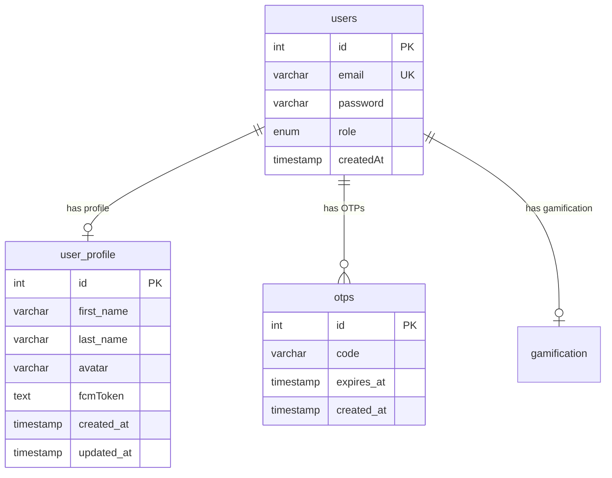
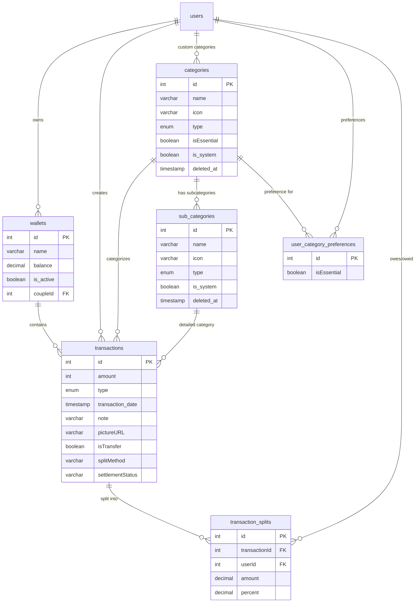
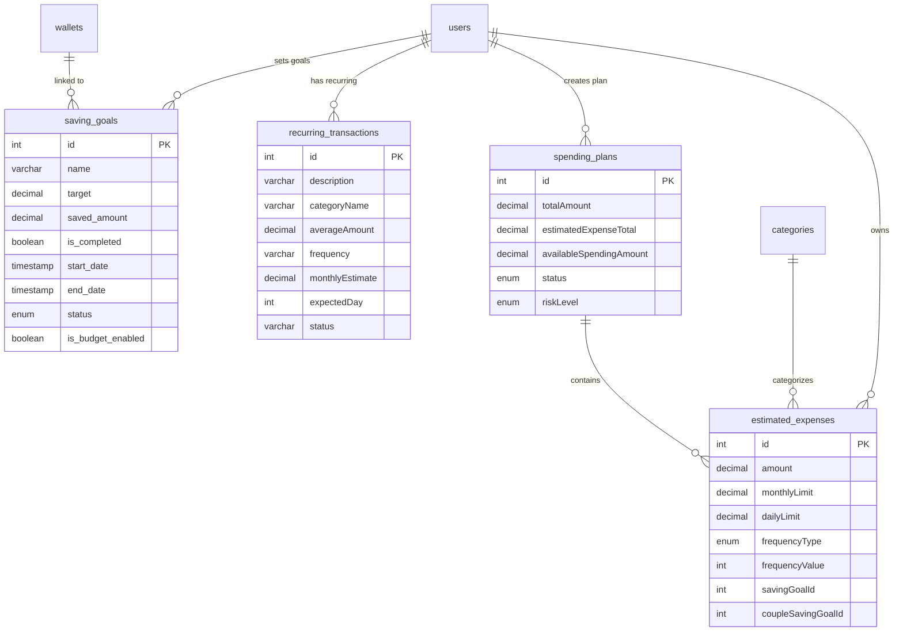
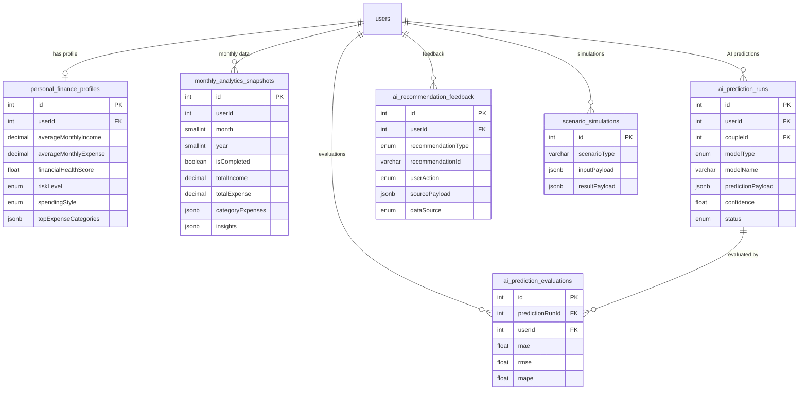
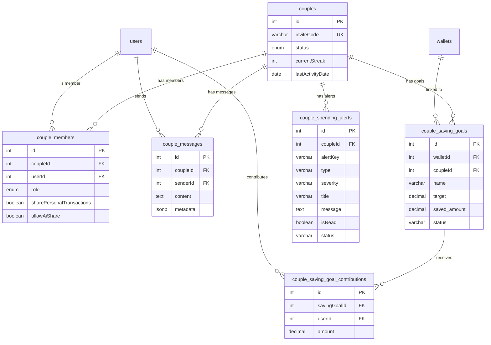
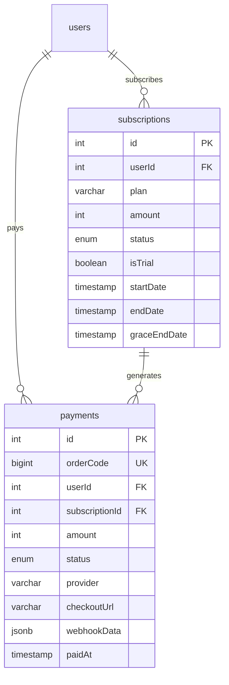
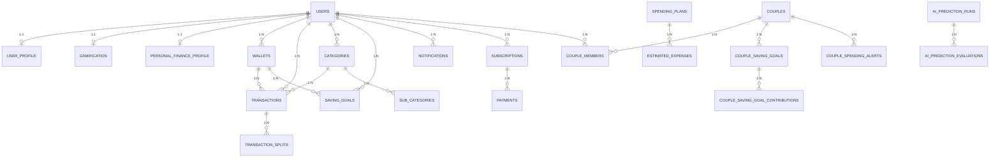

# MNCARE - Database Layer Architecture

> Tai lieu mo ta kien truc Database Layer cua du an MNCARE - Ung dung quan ly tai chinh tich hop AI.
> Cap nhat lan cuoi: 2026-06-22

---

## 1. Tong Quan He Thong

### 1.1 System Components

```
┌─────────────────┐     HTTPS/JSON      ┌─────────────────────┐     TypeORM/SQL     ┌──────────────────┐
│   Frontend      │ ──────────────────►  │   Backend Layer     │ ──────────────────► │   PostgreSQL     │
│   (Flutter)     │                      │   (NestJS)          │                     │   (Primary DB)   │
└─────────────────┘                      │                     │                     │                  │
                                         │   - REST API        │                     │  - ACID          │
                                         │   - Business Logic  │                     │  - Transactions  │
                                         │   - Validation      │                     │  - Constraints   │
                                         │   - Auth (JWT)      │                     │  - High Fidelity │
                                         └────────┬────────────┘                     └──────────────────┘
                                                  │
                                         ┌────────┴────────────┐
                                         │   External Services │
                                         │                     │
                                         │   - Gemini AI API   │
                                         │   - PayOS Gateway   │
                                         │   - Cloudinary      │
                                         │   - Firebase FCM    │
                                         │   - Google Auth     │
                                         └─────────────────────┘
```

### 1.2 Cac dac diem chinh

| Thanh phan         | Cong nghe                 | Ghi chu                                              |
| ------------------ | ------------------------- | ---------------------------------------------------- |
| Primary Database   | PostgreSQL                | Luu tru toan bo du lieu persistent                    |
| ORM                | TypeORM v0.3.27           | autoLoadEntities: true, synchronize: true             |
| Cache Layer        | Redis + In-memory fallback| Redis khi co cau hinh, fallback sang Map khi khong co |
| Schema Management  | TypeORM synchronize       | Tu dong sync schema khi start app (dev mode)          |
| Backend Framework  | NestJS v11                | Chi Backend Layer co quyen truy cap truc tiep DB      |
| Real-time          | Socket.IO (WebSocket)     | Chat couple, notifications                            |

### 1.3 Quy tac truy cap

- **CHI Backend Layer (NestJS) duoc truy cap truc tiep vao database.**
- Frontend (Flutter) giao tiep voi Backend qua REST API (HTTPS/JSON).
- External Services (Gemini AI, PayOS...) khong truy cap DB — Backend goi chung qua HTTP va luu ket qua vao DB.

---

## 2. Cache & Real-time Layer

### 2.1 Redis Cache (co In-Memory Fallback)

**File**: `src/common/cache/cache.service.ts`

| Tinh nang            | Mo ta                                                              |
| -------------------- | ------------------------------------------------------------------ |
| Redis connection     | Tu dong ket noi neu co `REDIS_URL` hoac `REDIS_HOST` trong .env    |
| In-memory fallback   | Khi khong co Redis, su dung `Map<string, MemoryCacheEntry>` local  |
| TTL support          | Ho tro set cache voi TTL (seconds)                                 |
| Key operations       | `get`, `set`, `del`, `delMany`, `delByPrefix`                      |
| Error handling       | Tu dong fallback khi Redis mat ket noi, log warning                |

### 2.2 Financial Cache Strategy

**Files**: `src/common/cache/financial-cache.util.ts`, `src/common/cache/financial-cache-invalidation.service.ts`

Cache key pattern:

```
v1:insights:user:{userId}:fund:{fundId}:period:{period}
v1:stats:user:{userId}:fund:{fundId}:summary:this_month
v1:ai_analysis:user:{userId}:fund:{fundId}:intent:{intentHash}
v1:ai_analysis:user:{userId}:fund:{fundId}:__registry__
```

Cache invalidation:
- Khi co thay doi giao dich/tai chinh, goi `FinancialCacheInvalidationService.invalidate(userId, goalIds)`
- Xoa dong thoi: financial cache keys + AI analysis registry + cac AI analysis keys da dang ky

### 2.3 Real-time Communication

| Thanh phan | Cong nghe  | Muc dich                       |
| ---------- | ---------- | ------------------------------ |
| WebSocket  | Socket.IO  | Chat couple, push notifications |

> Luu y: Chua su dung Redis Pub/Sub. Real-time hien tai hoat dong tren single instance.

---

## 3. Database Schema — Chi Tiet Entities

### 3.1 Enums Dung Chung

```typescript
// CategoryType (src/modules/categories/entities/category-type.enum.ts)
enum CategoryType {
  INCOME = 'income',
  EXPENSE = 'expense',
}

// UserRole (src/modules/user/entities/user.entity.ts)
enum UserRole {
  USER = 'user',
  ADMIN = 'admin',
}

// SavingGoalStatus (src/modules/saving-goals/enums/saving-goal-status.enum.ts)
enum SavingGoalStatus {
  ACTIVE = 'ACTIVE',
  PAUSED = 'PAUSED',
  EXPIRED = 'EXPIRED',
  COMPLETED = 'COMPLETED',
  ARCHIVED = 'ARCHIVED',
}

// SpendingPlanStatus, SpendingPlanRiskLevel, SpendingPlanExpenseFrequency
// (src/modules/spending-plans/interfaces/spending-plan.enums.ts)
enum SpendingPlanStatus {
  DRAFT = 'draft',
  ACTIVE = 'active',
  PAUSED = 'paused',
}

enum SpendingPlanRiskLevel {
  SAFE = 'safe',
  WARNING = 'warning',
  DANGER = 'danger',
}

enum SpendingPlanExpenseFrequency {
  DAILY = 'daily',
  WEEKLY = 'weekly',
  MONTHLY = 'monthly',
  ONCE = 'once',
}

// NotificationType (src/modules/notifications/entities/notification.entity.ts)
enum NotificationType {
  SYSTEM = 'system',
  REMINDER = 'reminder',
  ALERT = 'alert',
}

// PaymentStatus (src/modules/payments/entities/payment.entity.ts)
enum PaymentStatus {
  PENDING = 'pending',
  SUCCESS = 'success',
  FAILED = 'failed',
  CANCELLED = 'cancelled',
}

// SubscriptionStatus (src/modules/payments/entities/subscription.entity.ts)
enum SubscriptionStatus {
  PENDING = 'pending',
  ACTIVE = 'active',
  GRACE = 'grace',
  EXPIRED = 'expired',
  CANCELLED = 'cancelled',
}

// CoupleStatus (src/modules/couples/entities/couple.entity.ts)
enum CoupleStatus {
  PENDING = 'pending',
  ACTIVE = 'active',
  CANCELLED = 'cancelled',
  LEFT = 'left',
}

// CoupleRole (src/modules/couples/entities/couple-member.entity.ts)
enum CoupleRole {
  OWNER = 'owner',
  PARTNER = 'partner',
}
```

---

### 3.2 Nhom: User & Auth

#### 3.2.1 `users`

**Entity file**: `src/modules/user/entities/user.entity.ts`

| Column     | Type         | Constraints                   | Mo ta                   |
| ---------- | ------------ | ----------------------------- | ----------------------- |
| id         | int (PK)     | PrimaryGeneratedColumn, auto  | ID tu tang              |
| email      | varchar      | UNIQUE, NOT NULL              | Email dang nhap         |
| password   | varchar      | nullable, select: false       | Mat khau (hash bcrypt)  |
| role       | enum(UserRole)| default: 'user'              | Vai tro user            |
| createdAt  | timestamp    | CreateDateColumn              | Ngay tao tai khoan      |

**Relations**:
- `OneToOne → user_profile` (cascade: true, eager: true)
- `OneToMany → otps`
- `OneToMany → saving_goals`
- `OneToMany → categories`
- `OneToMany → user_category_preferences`
- `OneToMany → transactions`
- `OneToMany → notifications`
- `OneToMany → wallets`
- `OneToOne → gamification`
- `OneToMany → couple_members`
- `OneToMany → subscriptions`

---

#### 3.2.2 `user_profile`

**Entity file**: `src/modules/user-profile/entities/user-profile.entity.ts`

| Column     | Type         | Constraints                   | Mo ta                   |
| ---------- | ------------ | ----------------------------- | ----------------------- |
| id         | int (PK)     | PrimaryGeneratedColumn        | ID tu tang              |
| first_name | varchar      | nullable                      | Ten                     |
| last_name  | varchar      | nullable                      | Ho                      |
| avatar     | varchar      | nullable                      | URL anh dai dien        |
| fcmToken   | text         | nullable                      | Firebase Cloud Messaging token |
| created_at | timestamp    | CreateDateColumn              | Ngay tao                |
| updated_at | timestamp    | UpdateDateColumn              | Ngay cap nhat           |

**Relations**:
- `OneToOne → users` (onDelete: CASCADE, JoinColumn)

---

#### 3.2.3 `otps`

**Entity file**: `src/modules/otp/entities/otp.entity.ts`

| Column     | Type         | Constraints                   | Mo ta                   |
| ---------- | ------------ | ----------------------------- | ----------------------- |
| id         | int (PK)     | PrimaryGeneratedColumn        | ID tu tang              |
| code       | varchar      | NOT NULL                      | Ma OTP                  |
| expires_at | timestamp    | NOT NULL                      | Thoi gian het han       |
| created_at | timestamp    | CreateDateColumn              | Ngay tao                |

**Relations**:
- `ManyToOne → users` (onDelete: CASCADE)

---

### 3.2 ER Diagram — User & Auth



---

### 3.3 Nhom: Financial Core

#### 3.3.1 `wallets`

**Entity file**: `src/modules/wallets/entities/wallet.entity.ts`

| Column     | Type           | Constraints                        | Mo ta                    |
| ---------- | -------------- | ---------------------------------- | ------------------------ |
| id         | int (PK)       | PrimaryGeneratedColumn             | ID tu tang               |
| name       | varchar        | NOT NULL                           | Ten vi                   |
| balance    | decimal(15,2)  | default: 0, ColumnNumericTransformer | So du hien tai         |
| is_active  | boolean        | default: true                      | Trang thai hoat dong     |
| coupleId   | int            | nullable                           | FK den couples (neu vi chung) |
| created_at | timestamp      | CreateDateColumn                   | Ngay tao                 |
| updated_at | timestamp      | UpdateDateColumn                   | Ngay cap nhat            |

**Relations**:
- `ManyToOne → users` (onDelete: CASCADE, nullable)
- `ManyToOne → couples` (onDelete: CASCADE, nullable)
- `OneToMany → transactions`
- `OneToMany → saving_goals`

---

#### 3.3.2 `transactions`

**Entity file**: `src/modules/transactions/entities/transaction.entity.ts`

| Column            | Type                    | Constraints                  | Mo ta                          |
| ----------------- | ----------------------- | ---------------------------- | ------------------------------ |
| id                | int (PK)                | PrimaryGeneratedColumn       | ID tu tang                     |
| amount            | int                     | NOT NULL                     | So tien giao dich              |
| type              | enum('income','expense')| NOT NULL                     | Loai giao dich                 |
| transaction_date  | timestamp with time zone| nullable                     | Ngay giao dich                 |
| note              | varchar                 | nullable                     | Ghi chu                        |
| pictureURL        | varchar                 | nullable                     | URL anh hoa don                |
| isTransfer        | boolean                 | default: false               | La giao dich chuyen khoan?     |
| coupleId          | int                     | nullable                     | FK den couples                 |
| payerId           | int                     | nullable                     | FK den user (nguoi tra)        |
| splitMethod       | varchar                 | default: 'none'              | Phuong thuc chia: none/equal/percentage/fixed |
| settlementStatus  | varchar                 | nullable                     | Trang thai thanh toan: unsettled/settled/null  |
| settledAt         | timestamp with time zone| nullable                     | Thoi diem thanh toan           |
| settledById       | int                     | nullable                     | ID nguoi xac nhan thanh toan   |
| created_at        | timestamp               | CreateDateColumn             | Ngay tao                       |
| updated_at        | timestamp               | UpdateDateColumn             | Ngay cap nhat                  |

**Relations**:
- `ManyToOne → users` (onDelete: CASCADE)
- `ManyToOne → categories` (onDelete: SET NULL, nullable)
- `ManyToOne → sub_categories` (onDelete: SET NULL, nullable)
- `ManyToOne → wallets` (onDelete: SET NULL, nullable)
- `ManyToOne → couples` (onDelete: SET NULL, nullable)
- `ManyToOne → users as payer` (onDelete: SET NULL, nullable)
- `OneToMany → transaction_splits` (cascade: true)

---

#### 3.3.3 `transaction_splits`

**Entity file**: `src/modules/transactions/entities/transaction-split.entity.ts`

| Column        | Type          | Constraints                       | Mo ta                    |
| ------------- | ------------- | --------------------------------- | ------------------------ |
| id            | int (PK)      | PrimaryGeneratedColumn            | ID tu tang               |
| transactionId | int (FK)      | NOT NULL                          | FK den transactions      |
| userId        | int (FK)      | NOT NULL                          | FK den users             |
| amount        | decimal(15,2) | ColumnNumericTransformer          | So tien phan chia        |
| percent       | decimal(5,2)  | nullable, ColumnNumericTransformer| Ti le phan tram          |

**Relations**:
- `ManyToOne → transactions` (onDelete: CASCADE)
- `ManyToOne → users` (onDelete: CASCADE)

---

#### 3.3.4 `categories`

**Entity file**: `src/modules/categories/entities/category.entity.ts`

| Column     | Type             | Constraints                  | Mo ta                        |
| ---------- | ---------------- | ---------------------------- | ---------------------------- |
| id         | int (PK)         | PrimaryGeneratedColumn       | ID tu tang                   |
| name       | varchar          | NOT NULL                     | Ten danh muc                 |
| icon       | varchar          | nullable                     | Icon danh muc                |
| type       | enum(CategoryType)| default: 'expense'          | Loai: income/expense         |
| isEssential| boolean          | default: true                | Danh muc thiet yeu?          |
| is_system  | boolean          | default: false               | Danh muc he thong (khong xoa)|
| created_at | timestamp        | CreateDateColumn             | Ngay tao                     |
| updated_at | timestamp        | UpdateDateColumn             | Ngay cap nhat                |
| deleted_at | timestamp        | DeleteDateColumn (soft delete)| Ngay xoa mem                |

**Relations**:
- `ManyToOne → users` (onDelete: CASCADE, nullable — null = system category)
- `OneToMany → transactions`
- `OneToMany → sub_categories`

---

#### 3.3.5 `sub_categories`

**Entity file**: `src/modules/categories/entities/sub-category.entity.ts`

| Column     | Type             | Constraints                   | Mo ta                   |
| ---------- | ---------------- | ----------------------------- | ----------------------- |
| id         | int (PK)         | PrimaryGeneratedColumn        | ID tu tang              |
| name       | varchar          | NOT NULL                      | Ten danh muc con        |
| icon       | varchar          | nullable                      | Icon                    |
| type       | enum(CategoryType)| default: 'expense'           | Loai: income/expense    |
| is_system  | boolean          | default: true                 | Danh muc he thong?      |
| created_at | timestamp        | CreateDateColumn              | Ngay tao                |
| updated_at | timestamp        | UpdateDateColumn              | Ngay cap nhat           |
| deleted_at | timestamp        | DeleteDateColumn (soft delete)| Ngay xoa mem            |

**Relations**:
- `ManyToOne → categories` (onDelete: CASCADE)
- `OneToMany → transactions`

---

#### 3.3.6 `user_category_preferences`

**Entity file**: `src/modules/categories/entities/user-category-preference.entity.ts`

| Column      | Type    | Constraints                            | Mo ta                     |
| ----------- | ------- | -------------------------------------- | ------------------------- |
| id          | int (PK)| PrimaryGeneratedColumn                 | ID tu tang                |
| isEssential | boolean | default: true                          | Danh muc thiet yeu?       |
| createdAt   | timestamp| CreateDateColumn                      | Ngay tao                  |
| updatedAt   | timestamp| UpdateDateColumn                      | Ngay cap nhat             |

**Constraints**: `UNIQUE(user, category)`

**Relations**:
- `ManyToOne → users` (onDelete: CASCADE)
- `ManyToOne → categories` (onDelete: CASCADE, eager: true)

---

### 3.3 ER Diagram — Financial Core



---

### 3.4 Nhom: Budgeting & Planning

#### 3.4.1 `saving_goals`

**Entity file**: `src/modules/saving-goals/entities/saving-goal.entity.ts`

| Column              | Type                   | Constraints                       | Mo ta                          |
| ------------------- | ---------------------- | --------------------------------- | ------------------------------ |
| id                  | int (PK)               | PrimaryGeneratedColumn            | ID tu tang                     |
| name                | varchar                | NOT NULL                          | Ten muc tieu                   |
| target              | decimal(15,2)          | nullable, ColumnNumericTransformer| So tien muc tieu               |
| saved_amount        | decimal(15,2)          | default: 0, ColumnNumericTransformer | So tien da tiet kiem        |
| is_completed        | boolean                | default: false                    | Da hoan thanh?                 |
| start_date          | timestamp with time zone| nullable                         | Ngay bat dau                   |
| end_date            | timestamp with time zone| nullable                         | Ngay ket thuc                  |
| status              | enum(SavingGoalStatus) | default: 'PAUSED'                 | Trang thai muc tieu            |
| completion_notified | boolean                | default: false                    | Da gui thong bao hoan thanh?   |
| is_selected         | boolean                | default: false                    | Muc tieu dang chon?            |
| is_budget_enabled   | boolean                | default: false                    | Bat ke hoach chi tieu?         |
| created_at          | timestamp              | CreateDateColumn                  | Ngay tao                       |
| updated_at          | timestamp              | UpdateDateColumn                  | Ngay cap nhat                  |

**Relations**:
- `ManyToOne → users` (onDelete: CASCADE)
- `ManyToOne → wallets` (NOT NULL, onDelete: CASCADE)

---

#### 3.4.2 `spending_plans`

**Entity file**: `src/modules/spending-plans/entities/spending-plan.entity.ts`

| Column                  | Type                     | Constraints                       | Mo ta                          |
| ----------------------- | ------------------------ | --------------------------------- | ------------------------------ |
| id                      | int (PK)                 | PrimaryGeneratedColumn            | ID tu tang                     |
| totalAmount             | decimal(15,2)            | default: 0, ColumnNumericTransformer | Tong so tien ke hoach       |
| estimatedExpenseTotal   | decimal(15,2)            | default: 0, ColumnNumericTransformer | Tong chi phi du kien        |
| availableSpendingAmount | decimal(15,2)            | default: 0, ColumnNumericTransformer | So tien con lai kha dung   |
| status                  | enum(SpendingPlanStatus) | default: 'draft'                  | Trang thai ke hoach            |
| riskLevel               | enum(SpendingPlanRiskLevel)| default: 'warning'              | Muc do rui ro                  |
| createdAt               | timestamp                | CreateDateColumn                  | Ngay tao                       |
| updatedAt               | timestamp                | UpdateDateColumn                  | Ngay cap nhat                  |

**Relations**:
- `ManyToOne → users` (onDelete: CASCADE)
- `OneToMany → estimated_expenses` (cascade: true)

---

#### 3.4.3 `estimated_expenses`

**Entity file**: `src/modules/estimated-expenses/entities/estimated-expense.entity.ts`

| Column              | Type                          | Constraints                       | Mo ta                           |
| ------------------- | ----------------------------- | --------------------------------- | ------------------------------- |
| id                  | int (PK)                      | PrimaryGeneratedColumn            | ID tu tang                      |
| amount              | decimal(15,2)                 | default: 0, ColumnNumericTransformer | So tien du kien              |
| monthlyLimit        | decimal(15,2)                 | default: 0, ColumnNumericTransformer | Gioi han hang thang          |
| dailyLimit          | decimal(15,2)                 | nullable, ColumnNumericTransformer | Gioi han hang ngay              |
| frequencyType       | enum(SpendingPlanExpenseFrequency)| default: 'once'              | Tan suat chi tieu               |
| frequencyValue      | int                           | default: 1                        | Gia tri tan suat                |
| savingGoalId        | int                           | nullable                          | FK den saving_goals             |
| coupleSavingGoalId  | int                           | nullable                          | FK den couple_saving_goals      |
| createdAt           | timestamp                     | CreateDateColumn                  | Ngay tao                        |
| updatedAt           | timestamp                     | UpdateDateColumn                  | Ngay cap nhat                   |

**Relations**:
- `ManyToOne → spending_plans` (onDelete: CASCADE)
- `ManyToOne → users` (onDelete: CASCADE)
- `ManyToOne → categories` (onDelete: SET NULL, nullable, eager: true)
- `ManyToOne → sub_categories` (onDelete: SET NULL, nullable, eager: true)

---

#### 3.4.4 `recurring_transactions`

**Entity file**: `src/modules/spending-insights/entities/recurring-transaction.entity.ts`

| Column          | Type      | Constraints                | Mo ta                                 |
| --------------- | --------- | -------------------------- | ------------------------------------- |
| id              | int (PK)  | PrimaryGeneratedColumn     | ID tu tang                            |
| description     | varchar   | NOT NULL                   | Mo ta giao dich dinh ky               |
| categoryName    | varchar   | nullable                   | Ten danh muc                          |
| categoryIcon    | varchar   | nullable                   | Icon danh muc                         |
| averageAmount   | decimal   | NOT NULL                   | So tien trung binh                    |
| frequency       | varchar   | NOT NULL                   | Tan suat: weekly/bi_weekly/monthly    |
| monthlyEstimate | decimal   | default: 0                 | Uoc tinh hang thang                   |
| expectedDay     | int       | nullable                   | Ngay du kien trong thang              |
| status          | varchar   | default: 'confirmed'       | Trang thai: confirmed/dismissed       |
| aiRecurringId   | varchar   | nullable                   | ID tu AI detection                    |
| createdAt       | timestamp | CreateDateColumn           | Ngay tao                              |
| updatedAt       | timestamp | UpdateDateColumn           | Ngay cap nhat                         |

**Relations**:
- `ManyToOne → users` (onDelete: CASCADE)

---

### 3.4 ER Diagram — Budgeting & Planning



---

### 3.5 Nhom: AI & Analytics

#### 3.5.1 `personal_finance_profiles`

**Entity file**: `src/modules/personalization/entities/personal-finance-profile.entity.ts`

| Column                    | Type                | Constraints                       | Mo ta                           |
| ------------------------- | ------------------- | --------------------------------- | ------------------------------- |
| id                        | int (PK)            | PrimaryGeneratedColumn            | ID tu tang                      |
| userId                    | int (FK)            | NOT NULL                          | FK den users                    |
| periodStart               | timestamp with tz   | nullable                          | Bat dau ky phan tich            |
| periodEnd                 | timestamp with tz   | nullable                          | Ket thuc ky phan tich           |
| generatedAt               | timestamp with tz   | default: CURRENT_TIMESTAMP        | Thoi diem tao profile           |
| averageMonthlyIncome      | decimal(15,2)       | default: 0                        | Thu nhap trung binh/thang       |
| averageMonthlyExpense     | decimal(15,2)       | default: 0                        | Chi tieu trung binh/thang       |
| averageMonthlySavings     | decimal(15,2)       | default: 0                        | Tiet kiem trung binh/thang      |
| savingsRate               | float               | default: 0                        | Ti le tiet kiem                 |
| expenseVolatilityScore    | float               | default: 0                        | Diem do bien dong chi tieu      |
| budgetDisciplineScore     | float               | default: 0                        | Diem ky luat ngan sach          |
| financialHealthScore      | float               | default: 0                        | Diem suc khoe tai chinh         |
| riskLevel                 | enum(low/medium/high)| default: 'medium'                | Muc do rui ro                   |
| spendingStyle             | enum(6 values)      | default: 'insufficient_data'      | Phong cach chi tieu             |
| topExpenseCategories      | jsonb               | default: []                       | Top danh muc chi tieu           |
| essentialCategories       | jsonb               | default: []                       | Danh muc thiet yeu              |
| recurringExpenseHints     | jsonb               | default: []                       | Goi y chi phi dinh ky           |
| frequentExpenseDays       | jsonb               | default: []                       | Ngay chi tieu thuong xuyen      |
| monthlyIncomeTrend        | enum(3 values)      | default: 'stable'                 | Xu huong thu nhap               |
| monthlyExpenseTrend       | enum(3 values)      | default: 'stable'                 | Xu huong chi tieu               |
| preferredBudgetBufferPct  | float               | default: 0.1                      | Ti le buffer ngan sach          |
| confidenceScore           | float               | default: 0                        | Do tin cay profile              |
| feedbackSummary           | jsonb               | default: {}                       | Tom tat feedback                |
| profileVersion            | varchar             | default: 'v1'                     | Phien ban profile               |
| createdAt                 | timestamp           | CreateDateColumn                  | Ngay tao                        |
| updatedAt                 | timestamp           | UpdateDateColumn                  | Ngay cap nhat                   |

**Relations**:
- `OneToOne → users` (onDelete: CASCADE, JoinColumn)

**spendingStyle values**: `'stable' | 'impulsive' | 'seasonal' | 'goal_driven' | 'income_driven' | 'insufficient_data'`

---

#### 3.5.2 `monthly_analytics_snapshots`

**Entity file**: `src/modules/analytics/entities/monthly-analytics-snapshot.entity.ts`

| Column            | Type          | Constraints                       | Mo ta                           |
| ----------------- | ------------- | --------------------------------- | ------------------------------- |
| id                | int (PK)      | PrimaryGeneratedColumn            | ID tu tang                      |
| userId            | int           | NOT NULL                          | FK den users                    |
| month             | smallint      | NOT NULL (1-12)                   | Thang                           |
| year              | smallint      | NOT NULL                          | Nam                             |
| isCompleted       | boolean       | default: false                    | Thang da dong (cron da chay)?   |
| totalIncome       | decimal(15,2) | default: 0                        | Tong thu nhap                   |
| totalExpense      | decimal(15,2) | default: 0                        | Tong chi tieu                   |
| transactionCount  | int           | default: 0                        | So luong giao dich              |
| categoryExpenses  | jsonb         | default: {}                       | Chi tieu theo danh muc          |
| categoryIncomes   | jsonb         | default: {}                       | Thu nhap theo danh muc          |
| healthScore       | int           | nullable                          | Diem suc khoe (khi isCompleted) |
| cashFlowTrend     | varchar(50)   | nullable                          | Xu huong: improving/stable/worsening |
| forecastData      | jsonb         | nullable                          | Du lieu du bao                  |
| budgetingData     | jsonb         | nullable                          | Du lieu ngan sach               |
| anomalies         | jsonb         | nullable                          | Cac bat thuong                  |
| insights          | jsonb         | nullable                          | Nhan dinh AI                    |
| categoryStats     | jsonb         | nullable                          | Thong ke danh muc (mean, stdDev, count) |
| createdAt         | timestamp     | CreateDateColumn                  | Ngay tao                        |
| updatedAt         | timestamp     | UpdateDateColumn                  | Ngay cap nhat                   |

**Constraints**:
- `UNIQUE(userId, month, year)`
- `INDEX(userId, isCompleted)`

---

#### 3.5.3 `ai_prediction_runs`

**Entity file**: `src/modules/analytics/entities/ai-prediction-run.entity.ts`

| Column               | Type              | Constraints                       | Mo ta                           |
| -------------------- | ----------------- | --------------------------------- | ------------------------------- |
| id                   | int (PK)          | PrimaryGeneratedColumn            | ID tu tang                      |
| userId               | int (FK)          | NOT NULL                          | FK den users                    |
| coupleId             | int               | nullable                          | FK den couples (neu la couple)  |
| modelType            | enum(4 values)    | NOT NULL                          | Loai model AI                   |
| modelName            | varchar(100)      | NOT NULL                          | Ten model                       |
| modelVersion         | varchar(20)       | default: 'v1'                     | Phien ban model                 |
| inputPeriodStart     | timestamp with tz | nullable                          | Bat dau du lieu dau vao         |
| inputPeriodEnd       | timestamp with tz | nullable                          | Ket thuc du lieu dau vao        |
| predictionTargetStart| timestamp with tz | NOT NULL                          | Bat dau ky du bao               |
| predictionTargetEnd  | timestamp with tz | NOT NULL                          | Ket thuc ky du bao              |
| predictionPayload    | jsonb             | default: {}                       | Ket qua du bao                  |
| inputSnapshot        | jsonb             | default: {}                       | Snapshot du lieu dau vao        |
| confidence           | float             | default: 0                        | Do tin cay du bao               |
| status               | enum(4 values)    | default: 'pending'                | Trang thai: pending/evaluated/expired/skipped |
| createdAt            | timestamp         | CreateDateColumn                  | Ngay tao                        |
| updatedAt            | timestamp         | UpdateDateColumn                  | Ngay cap nhat                   |

**modelType values**: `'forecasting' | 'budgeting' | 'categorization' | 'couple_forecasting'`

**Indexes**:
- `INDEX(userId, modelType, modelName, createdAt)`
- `INDEX(status)`
- `INDEX(predictionTargetEnd)`
- `INDEX(coupleId, modelType, createdAt)`

---

#### 3.5.4 `ai_prediction_evaluations`

**Entity file**: `src/modules/analytics/entities/ai-prediction-evaluation.entity.ts`

| Column              | Type         | Constraints                       | Mo ta                           |
| ------------------- | ------------ | --------------------------------- | ------------------------------- |
| id                  | int (PK)     | PrimaryGeneratedColumn            | ID tu tang                      |
| predictionRunId     | int (FK)     | NOT NULL                          | FK den ai_prediction_runs       |
| userId              | int (FK)     | NOT NULL                          | FK den users                    |
| actualPayload       | jsonb        | default: {}                       | Du lieu thuc te                 |
| metrics             | jsonb        | default: {}                       | Cac chi so danh gia             |
| mae                 | float        | nullable                          | Mean Absolute Error             |
| rmse                | float        | nullable                          | Root Mean Square Error          |
| mape                | float        | nullable                          | Mean Absolute Percentage Error  |
| directionalAccuracy | float        | nullable                          | Do chinh xac huong              |
| evaluatedAt         | timestamp with tz| default: CURRENT_TIMESTAMP      | Thoi diem danh gia              |
| createdAt           | timestamp    | CreateDateColumn                  | Ngay tao                        |

**Indexes**:
- `INDEX(userId)`
- `INDEX(evaluatedAt)`

---

#### 3.5.5 `ai_recommendation_feedback`

**Entity file**: `src/modules/ai-feedback/entities/ai-recommendation-feedback.entity.ts`

| Column               | Type              | Constraints                       | Mo ta                           |
| -------------------- | ----------------- | --------------------------------- | ------------------------------- |
| id                   | int (PK)          | PrimaryGeneratedColumn            | ID tu tang                      |
| userId               | int (FK)          | NOT NULL                          | FK den users                    |
| recommendationType   | enum(5 values)    | NOT NULL                          | Loai khuyen nghi AI             |
| recommendationId     | varchar(160)      | NOT NULL                          | ID cua khuyen nghi              |
| sourceModel          | varchar(100)      | nullable                          | Model nguon                     |
| sourceModelVersion   | varchar(40)       | nullable                          | Phien ban model nguon           |
| userAction           | enum(7 values)    | NOT NULL                          | Hanh dong cua user              |
| sourcePayload        | jsonb             | default: {}                       | Du lieu goc AI                  |
| modifiedPayload      | jsonb             | nullable                          | Du lieu user chinh sua          |
| contextPayload       | jsonb             | nullable                          | Ngu canh                        |
| dataSource           | enum(real/synthetic)| default: 'real'                 | Nguon du lieu                   |
| outcomePayload       | jsonb             | nullable                          | Ket qua thuc te                 |
| outcomeMeasuredAt    | timestamp         | nullable                          | Thoi diem do ket qua            |
| reasonText           | varchar(500)      | nullable                          | Ly do cua user                  |
| createdAt            | timestamp         | CreateDateColumn                  | Ngay tao                        |
| updatedAt            | timestamp         | UpdateDateColumn                  | Ngay cap nhat                   |

**recommendationType values**: `'budget' | 'category' | 'saving_goal' | 'forecast_insight' | 'chatbot'`

**userAction values**: `'accepted' | 'modified' | 'rejected' | 'dismissed' | 'corrected' | 'helpful' | 'not_helpful'`

**Indexes**:
- `INDEX(userId)`
- `INDEX(recommendationType)`
- `INDEX(recommendationId)`
- `INDEX(userAction)`
- `INDEX(createdAt)`
- `INDEX(userId, recommendationType, createdAt)`
- `INDEX(userId, recommendationId)`

---

#### 3.5.6 `scenario_simulations`

**Entity file**: `src/modules/scenario-planning/entities/scenario-simulation.entity.ts`

| Column        | Type    | Constraints            | Mo ta                       |
| ------------- | ------- | ---------------------- | --------------------------- |
| id            | int (PK)| PrimaryGeneratedColumn | ID tu tang                  |
| scenarioType  | varchar | NOT NULL               | Loai kich ban               |
| inputPayload  | jsonb   | NOT NULL               | Du lieu dau vao             |
| resultPayload | jsonb   | NOT NULL               | Ket qua mo phong            |
| createdAt     | timestamp| CreateDateColumn       | Ngay tao                    |

**Relations**:
- `ManyToOne → users` (onDelete: CASCADE)

---

### 3.5 ER Diagram — AI & Analytics



---

### 3.6 Nhom: Couples

#### 3.6.1 `couples`

**Entity file**: `src/modules/couples/entities/couple.entity.ts`

| Column           | Type              | Constraints            | Mo ta                       |
| ---------------- | ----------------- | ---------------------- | --------------------------- |
| id               | int (PK)          | PrimaryGeneratedColumn | ID tu tang                  |
| inviteCode       | varchar           | UNIQUE, NOT NULL       | Ma moi ghep cap             |
| status           | enum(CoupleStatus)| default: 'pending'    | Trang thai couple           |
| currentStreak    | int               | default: 0             | Chuoi lien tiep hoat dong   |
| lastActivityDate | date              | nullable               | Ngay hoat dong cuoi         |
| createdAt        | timestamp         | CreateDateColumn       | Ngay tao                    |
| updatedAt        | timestamp         | UpdateDateColumn       | Ngay cap nhat               |

**Relations**:
- `OneToMany → couple_members` (cascade: true)

---

#### 3.6.2 `couple_members`

**Entity file**: `src/modules/couples/entities/couple-member.entity.ts`

| Column                     | Type            | Constraints            | Mo ta                        |
| -------------------------- | --------------- | ---------------------- | ---------------------------- |
| id                         | int (PK)        | PrimaryGeneratedColumn | ID tu tang                   |
| coupleId                   | int (FK)        | NOT NULL               | FK den couples               |
| userId                     | int (FK)        | NOT NULL               | FK den users                 |
| role                       | enum(CoupleRole)| NOT NULL               | Vai tro: owner/partner       |
| sharePersonalTransactions  | boolean         | default: false         | Chia se giao dich ca nhan?   |
| allowAiShare               | boolean         | default: false         | Cho phep AI chia se?         |
| joinedAt                   | timestamp       | CreateDateColumn       | Ngay tham gia                |

**Relations**:
- `ManyToOne → couples` (onDelete: CASCADE, JoinColumn)
- `ManyToOne → users` (onDelete: CASCADE, JoinColumn)

---

#### 3.6.3 `couple_messages`

**Entity file**: `src/modules/couples/entities/couple-message.entity.ts`

| Column    | Type         | Constraints            | Mo ta                    |
| --------- | ------------ | ---------------------- | ------------------------ |
| id        | int (PK)     | PrimaryGeneratedColumn | ID tu tang               |
| coupleId  | int (FK)     | NOT NULL               | FK den couples           |
| senderId  | int (FK)     | NOT NULL               | FK den users             |
| content   | text         | NOT NULL               | Noi dung tin nhan        |
| metadata  | jsonb        | nullable               | Du lieu them (optional)  |
| createdAt | timestamp with tz| CreateDateColumn     | Thoi gian gui            |

**Relations**:
- `ManyToOne → couples` (onDelete: CASCADE)
- `ManyToOne → users as sender` (onDelete: CASCADE)

---

#### 3.6.4 `couple_saving_goals`

**Entity file**: `src/modules/couples/entities/couple-saving-goal.entity.ts`

| Column              | Type          | Constraints                       | Mo ta                         |
| ------------------- | ------------- | --------------------------------- | ----------------------------- |
| id                  | int (PK)      | PrimaryGeneratedColumn            | ID tu tang                    |
| walletId            | int           | nullable                          | FK den wallets                |
| coupleId            | int (FK)      | NOT NULL                          | FK den couples                |
| name                | varchar       | NOT NULL                          | Ten muc tieu chung            |
| target              | decimal(15,2) | nullable, ColumnNumericTransformer| So tien muc tieu              |
| saved_amount        | decimal(15,2) | default: 0, ColumnNumericTransformer | So tien da tiet kiem       |
| start_date          | timestamp with tz| nullable                       | Ngay bat dau                  |
| end_date            | timestamp with tz| nullable                       | Ngay ket thuc                 |
| status              | varchar       | default: 'active'                 | Trang thai muc tieu           |
| completion_notified | boolean       | default: false                    | Da gui thong bao hoan thanh?  |
| is_budget_enabled   | boolean       | default: false                    | Bat ke hoach ngan sach?       |
| createdAt           | timestamp     | CreateDateColumn                  | Ngay tao                      |
| updatedAt           | timestamp     | UpdateDateColumn                  | Ngay cap nhat                 |

**Relations**:
- `ManyToOne → wallets` (onDelete: SET NULL, nullable)
- `ManyToOne → couples` (onDelete: CASCADE)
- `OneToMany → couple_saving_goal_contributions` (cascade: true)

---

#### 3.6.5 `couple_saving_goal_contributions`

**Entity file**: `src/modules/couples/entities/couple-saving-goal-contribution.entity.ts`

| Column       | Type          | Constraints                       | Mo ta                    |
| ------------ | ------------- | --------------------------------- | ------------------------ |
| id           | int (PK)      | PrimaryGeneratedColumn            | ID tu tang               |
| savingGoalId | int (FK)      | NOT NULL                          | FK den couple_saving_goals |
| userId       | int (FK)      | NOT NULL                          | FK den users             |
| amount       | decimal(15,2) | ColumnNumericTransformer          | So tien dong gop         |
| createdAt    | timestamp     | CreateDateColumn                  | Ngay tao                 |
| updatedAt    | timestamp     | UpdateDateColumn                  | Ngay cap nhat            |

**Relations**:
- `ManyToOne → couple_saving_goals` (onDelete: CASCADE)
- `ManyToOne → users` (onDelete: CASCADE)

---

#### 3.6.6 `couple_spending_alerts`

**Entity file**: `src/modules/couples/entities/couple-spending-alert.entity.ts`

| Column        | Type          | Constraints                       | Mo ta                          |
| ------------- | ------------- | --------------------------------- | ------------------------------ |
| id            | int (PK)      | PrimaryGeneratedColumn            | ID tu tang                     |
| coupleId      | int (FK)      | NOT NULL                          | FK den couples                 |
| alertKey      | varchar       | NOT NULL                          | Key dinh danh canh bao         |
| type          | varchar(40)   | NOT NULL                          | Loai canh bao                  |
| severity      | varchar(20)   | default: 'medium'                 | Muc do: low/medium/high        |
| title         | varchar       | NOT NULL                          | Tieu de canh bao               |
| message       | text          | NOT NULL                          | Noi dung canh bao              |
| transactionId | int           | nullable                          | FK den transactions            |
| categoryId    | int           | nullable                          | FK den categories              |
| amount        | decimal(15,2) | nullable                          | So tien lien quan              |
| details       | jsonb         | nullable                          | Chi tiet them (exceeded, anomalies...) |
| isRead        | boolean       | default: false                    | Da doc?                        |
| status        | varchar(20)   | default: 'open'                   | Trang thai: open/resolved/dismissed |
| feedback      | varchar(20)   | nullable                          | Feedback: correct/incorrect/ignored |
| feedbackById  | int           | nullable                          | FK den users (nguoi feedback)  |
| feedbackAt    | timestamp with tz| nullable                       | Thoi diem feedback             |
| createdAt     | timestamp     | CreateDateColumn                  | Ngay tao                       |
| updatedAt     | timestamp     | UpdateDateColumn                  | Ngay cap nhat                  |

**Constraints**:
- `UNIQUE(coupleId, alertKey)`

**Relations**:
- `ManyToOne → couples` (onDelete: CASCADE)
- `ManyToOne → transactions` (onDelete: SET NULL, nullable)
- `ManyToOne → categories` (onDelete: SET NULL, nullable)
- `ManyToOne → users as feedbackBy` (onDelete: SET NULL, nullable)

---

### 3.6 ER Diagram — Couples



---

### 3.7 Nhom: Payments & Subscription

#### 3.7.1 `subscriptions`

**Entity file**: `src/modules/payments/entities/subscription.entity.ts`

| Column       | Type                     | Constraints                | Mo ta                          |
| ------------ | ------------------------ | -------------------------- | ------------------------------ |
| id           | int (PK)                 | PrimaryGeneratedColumn     | ID tu tang                     |
| userId       | int (FK)                 | NOT NULL                   | FK den users                   |
| plan         | varchar                  | default: 'premium_monthly' | Ten goi dang ky                |
| amount       | int                      | default: 49999             | So tien (VND)                  |
| status       | enum(SubscriptionStatus) | default: 'pending'         | Trang thai subscription        |
| isTrial      | boolean                  | default: false             | La ban dung thu?               |
| startDate    | timestamp with tz        | nullable                   | Ngay bat dau                   |
| endDate      | timestamp with tz        | nullable                   | Ngay ket thuc                  |
| graceEndDate | timestamp with tz        | nullable                   | Ngay het han grace (endDate + 3 ngay) |
| createdAt    | timestamp                | CreateDateColumn           | Ngay tao                       |
| updatedAt    | timestamp                | UpdateDateColumn           | Ngay cap nhat                  |

**Relations**:
- `ManyToOne → users` (onDelete: CASCADE, JoinColumn)

---

#### 3.7.2 `payments`

**Entity file**: `src/modules/payments/entities/payment.entity.ts`

| Column               | Type               | Constraints              | Mo ta                          |
| -------------------- | ------------------ | ------------------------ | ------------------------------ |
| id                   | int (PK)           | PrimaryGeneratedColumn   | ID tu tang                     |
| orderCode            | bigint             | UNIQUE, NOT NULL         | PayOS orderCode (int64)        |
| userId               | int (FK)           | NOT NULL                 | FK den users                   |
| subscriptionId       | int (FK)           | NOT NULL                 | FK den subscriptions           |
| amount               | int                | NOT NULL                 | So tien thanh toan             |
| status               | enum(PaymentStatus)| default: 'pending'      | Trang thai thanh toan          |
| provider             | varchar            | default: 'payos'        | Nha cung cap thanh toan        |
| providerTransactionId| varchar            | nullable                | ID giao dich tu provider       |
| webhookData          | jsonb              | nullable                | Du lieu webhook tu PayOS       |
| checkoutUrl          | varchar            | nullable                | URL trang thanh toan           |
| createdAt            | timestamp          | CreateDateColumn         | Ngay tao                       |
| paidAt               | timestamp with tz  | nullable                | Thoi diem thanh toan           |

**Relations**:
- `ManyToOne → users` (onDelete: CASCADE, JoinColumn)
- `ManyToOne → subscriptions` (onDelete: CASCADE, JoinColumn)

---

### 3.7 ER Diagram — Payments & Subscription



---

### 3.8 Nhom: System & Engagement

#### 3.8.1 `notifications`

**Entity file**: `src/modules/notifications/entities/notification.entity.ts`

| Column    | Type                   | Constraints              | Mo ta                    |
| --------- | ---------------------- | ------------------------ | ------------------------ |
| id        | int (PK)               | PrimaryGeneratedColumn   | ID tu tang               |
| title     | varchar                | NOT NULL                 | Tieu de thong bao        |
| body      | text                   | default: ''              | Noi dung thong bao       |
| type      | enum(NotificationType) | default: 'system'       | Loai: system/reminder/alert |
| isRead    | boolean                | default: false           | Da doc?                  |
| createdAt | timestamp              | CreateDateColumn         | Ngay tao                 |

**Relations**:
- `ManyToOne → users` (onDelete: CASCADE)

---

#### 3.8.2 `gamification`

**Entity file**: `src/modules/gamification/entities/gamification.entity.ts`

| Column              | Type    | Constraints                 | Mo ta                       |
| ------------------- | ------- | --------------------------- | --------------------------- |
| id                  | int (PK)| PrimaryGeneratedColumn      | ID tu tang                  |
| userId              | int     | UNIQUE, NOT NULL            | FK den users                |
| currentStreak       | int     | default: 0                  | Chuoi lien tiep ngay ghi nhan|
| lastTransactionDate | date    | nullable                    | Ngay giao dich cuoi cung    |
| badges              | jsonb   | default: []                 | Danh sach huy hieu          |
| createdAt           | timestamp| CreateDateColumn           | Ngay tao                    |
| updatedAt           | timestamp| UpdateDateColumn           | Ngay cap nhat               |

**badges jsonb structure**:
```typescript
{ key: string; name: string; awardedAt: string }[]
```

**Relations**:
- `OneToOne → users` (onDelete: CASCADE, JoinColumn)

---

### 3.8 ER Diagram — System & Engagement

```mermaid
erDiagram
    users ||--o{ notifications : "receives"
    users ||--o| gamification : "has stats"

    notifications {
        int id PK
        varchar title
        text body
        enum type
        boolean isRead
        timestamp createdAt
    }

    gamification {
        int id PK
        int userId FK_UK
        int currentStreak
        date lastTransactionDate
        jsonb badges
    }
```

---

## 4. Tong Quan Quan He Giua Cac Nhom



---

## 5. Dac Diem Ky Thuat Quan Trong

### 5.1 Decimal Handling

Su dung `ColumnNumericTransformer` de chuyen `decimal` cua PostgreSQL sang `number` trong TypeScript:

```typescript
// File: src/common/transformers/decimal.transformer.ts
// Ap dung cho: balance (wallets), target/saved_amount (saving_goals),
//              amount (transaction_splits, estimated_expenses, couple contributions),
//              totalAmount/estimatedExpenseTotal/availableSpendingAmount (spending_plans),
//              averageMonthlyIncome/Expense/Savings (personal_finance_profiles)
```

### 5.2 Soft Delete

Chi cac entity su dung soft delete (DeleteDateColumn):
- `categories` → `deleted_at`
- `sub_categories` → `deleted_at`

Tat ca cac entity khac su dung **hard delete** voi cascade.

### 5.3 Cascade Delete Strategy

| Kieu cascade     | Ap dung cho                                                  |
| ---------------- | ------------------------------------------------------------ |
| `CASCADE`        | Phan lon relations (user xoa → xoa het du lieu lien quan)     |
| `SET NULL`       | Transaction → category, wallet, couple (giu giao dich khi xoa danh muc/vi) |

### 5.4 Timestamp Convention

- Cac entity cu dung `snake_case`: `created_at`, `updated_at`
- Cac entity moi dung `camelCase`: `createdAt`, `updatedAt`
- Cac truong ngay co timezone dung `timestamp with time zone`

### 5.5 JSONB Usage

JSONB duoc su dung nhieu cho du lieu co cau truc linh hoat:
- `gamification.badges` — Mang huy hieu
- `monthly_analytics_snapshots.categoryExpenses/categoryIncomes/forecastData/anomalies/insights`
- `ai_prediction_runs.predictionPayload/inputSnapshot`
- `ai_recommendation_feedback.sourcePayload/modifiedPayload/contextPayload/outcomePayload`
- `personal_finance_profiles.topExpenseCategories/essentialCategories/feedbackSummary`
- `couple_spending_alerts.details`
- `couple_messages.metadata`
- `payments.webhookData`

### 5.6 Schema Management

```typescript
// app.module.ts — TypeORM Configuration
TypeOrmModule.forRootAsync({
  useFactory: (configService: ConfigService) => ({
    type: 'postgres',
    // ... connection config
    autoLoadEntities: true,  // Tu dong load entities tu cac module
    synchronize: true,       // Tu dong sync schema (chi dung cho development)
    logging: false,
  }),
});
```

> **Luu y**: `synchronize: true` chi phu hop cho moi truong development. 
> Trong production nen chuyen sang TypeORM migrations.

---

## 6. Thong Ke Tong Hop

| Metric                   | Value |
| ------------------------ | ----- |
| Tong so entities (tables)| 29    |
| Tong so modules          | 21    |
| Entities co soft delete  | 2     |
| Entities dung JSONB      | 8     |
| Entities co custom index | 4     |
| Enums duoc su dung       | 12    |
| OneToOne relations       | 3     |
| Decimal fields (financial)| 14   |

---

## 7. Environment Variables — Database & Cache

```bash
# PostgreSQL
DB_HOST=localhost
DB_PORT=5432
DB_USER=postgres
DB_PASS=***
DB_NAME=moneycare
# DATABASE_URL=postgresql://...  (uu tien neu co)

# Redis Cache (optional)
REDIS_URL=           # Hoac su dung REDIS_HOST + REDIS_PORT + REDIS_PASSWORD
REDIS_HOST=
REDIS_PORT=6379
REDIS_PASSWORD=
```

---

> **Document nay duoc tao tu dong tu source code thuc te cua du an MNCARE.**
> Moi thay doi entity can cap nhat lai tai lieu nay.
